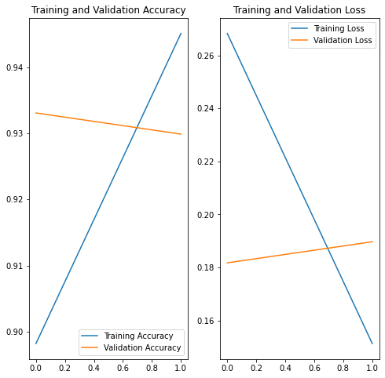

# Rice-image-classification


[](https://github.com/Haliacal/Rice-Image-Classification) 


## Summary

Predicting type of rice using the keras and tensorflow. Achieving a test accuracy: 0.9451 and a validation accuracy: 0.9299. Dataset had over 75000 images.

``` test.ipynb ```
* Importing data
* testing functions
* Creating different combinations of the model

``` main.py ```
* Finalising Model
* Options to save and load trained data

## Background

This is a rice image classifier using the [data](https://www.kaggle.com/datasets/muratkokludataset/rice-image-dataset) set from Kaggle. I wanted to test and apply concepts within AI to create a convolution network. In the end I was able to apply data augmentation and dropout to prevent overfitting. Resizing the data also helped to fit the data and cut down on computation expenses. I went with a resizing of 28x28.
Since te data is quite simple, only 2 epochs was needed to achieve a good fit which can be seen in the results.

## Results


